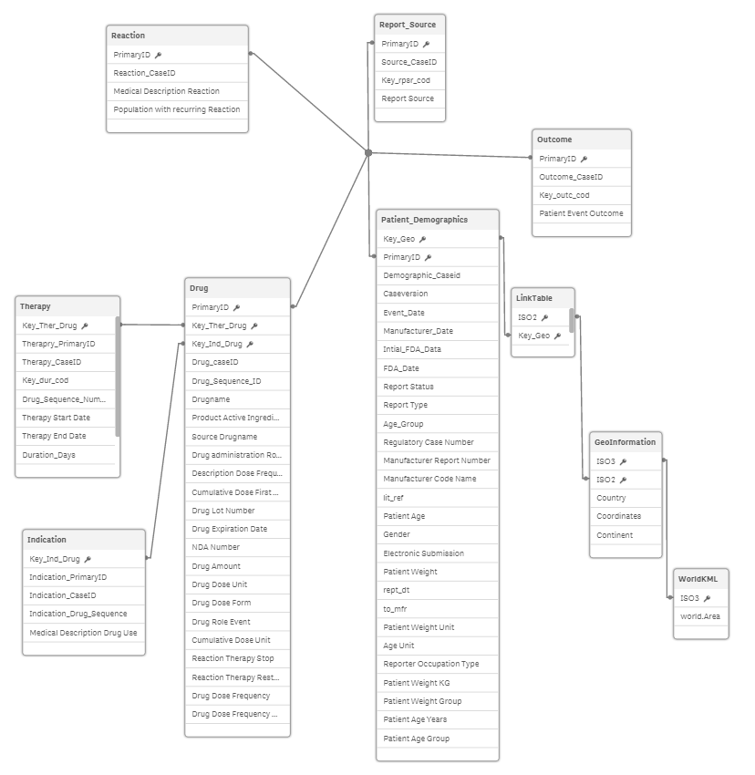

# Assisted Prescription Requirements

This section lists the requirements set by the Qliktive company on the Assisted Prescription application.

## Non-Functional Requirements

### Deployment

- The application shall use Docker and Docker Swarm in the backend implementation.
- The application shall be deployed to AWS as cloud provider, although is should be possible to move to another provider
  or to an on-prem deployment with minimal efforts.

### Testing

- Basic end-to-end tests.
- Stress tests shall exist, so that it is possible to find out the limits of the given setup (machines & number of
  distributed services), examples of these limits may be:
  - Max requests/hits handled per sec
  - Failure rate / Errors per second
  - Avg/Min/Max response time
  - Latency
  - Number of users handled by the system
- Stress tests shall be configurable with:
  - Peak number of concurrent users
  - Activity pattern of users (just watching, heavily making selections, etc.)

## General Functional Requirements

### End User Requirements

- As an end-user I want to be able to use a UI tailored for my needs so I can quickly find the insights I need.
- As an end-user I want to be able to stay logged in so that I can access the portal conveniently.

### Operation

- The system shall support peak traffic of around 10.000 simultaneous connections and an average of 500 on the given
  data model.
- The system shall support updates without interruption of the service.
- The system shall meet industry best practices for monitoring of the system.

## Detailed Functional Requirements

## User Interface

- The main benefit for doctors is to be able to narrow analysis based on advanced collection of demographic criteria
(gender, weight, origin etc.).

The web application presents information in four main tabs focusing on:

* filters
* prescription viz/table
* side effects/reactions viz/table
* report

(There will be multiple objects on each single page)

### Scaling

- It shall be possible to scale the system up or down with respect to the number of nodes hosting QIX Engine instances.
- Scaling shall be done manually by invocing single command or script.
- While it is a basic assumption of this use-case, that scaling is done manually,
- ??? I'd like to know as a developer where I could hook into the APIs to create my custom, fully automated scaling strategy.

### Monitoring

The following shall be supported:

- Monitoring of the system and find potential issues and operational failures.
- Monitoring of system logs from all services/containers.
- Monitoring of the number of page-hits/sessions over time.
- Monitoring of typical KPIs of the system (page-hits, sessions, up-time, down-time, reliability, etc.)
- Monitoring of system load so that decisions can be taken whether to scale the system up or down with respect to the
  number of nodes hosting QIX Engine instances.
- Monitoring of QiX Engine containers, how they are behaving including detailed log entries and error messages from
  these containers.

## Assumptions

* All users must log in to use the application.
* The data set (no dynamic data reduction) is the same for every end user.
* Data reloading is done every quarter when FDA releases updated information.
* No subscription model is implemented (relies on authentication permissions only.)

## Data

This use case is characterized by a
[single qvf](https://github.com/qlik-ea/qliktive-custom-analytics/blob/master/data/doc/drugcases.qvf) with the following
data model:

