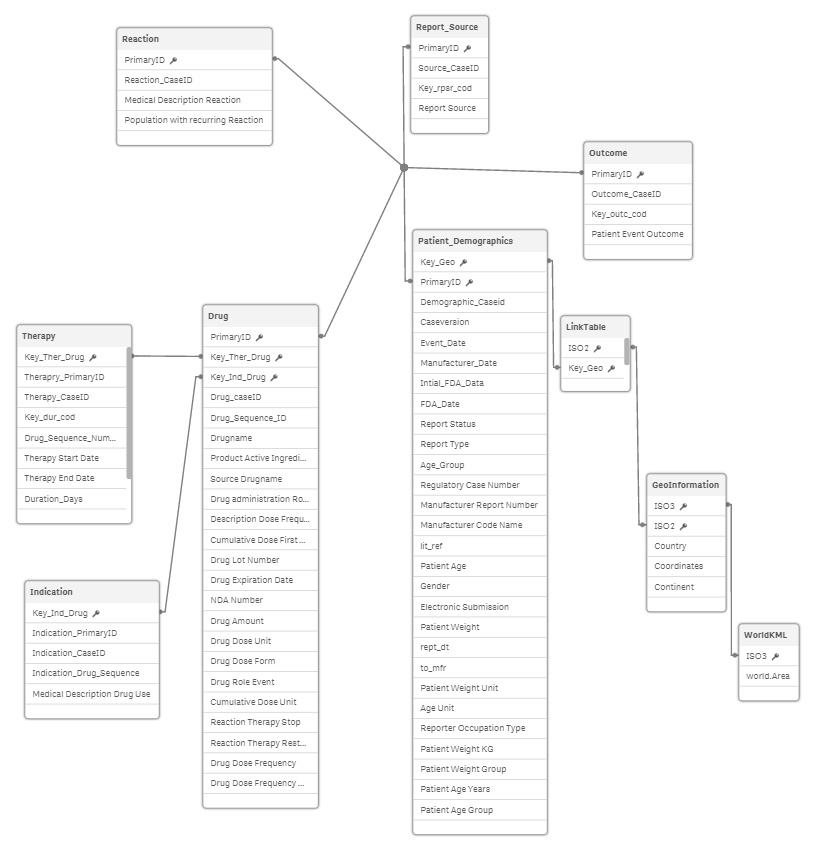

# Assisted Prescription Requirements

This section lists the requirements set by the Qliktive company on the Assisted Prescription application.

## Non-Functional Requirements

### Implementation/Deployment

The application shall:

- Use Docker and Docker Swarm in the backend implementation.
- Be deployed to AWS as cloud provider, although it should be possible to move to another provider or to an on-prem
  deployment with minimal efforts.
- Rely on JWTs in the backend implementatin as the means of authentication.
- Use a third party identity provider.

### Operation

The system shall:

- Support peak traffic of around 10.000 simultaneous connections and an average of 500 on the given
  data model.
- Support updates without interruption of the service.
- Be possible to scale up or down with respect to the number of nodes hosting Qlik Associative Engine instances.
- Support manually scaling by invoking a single command or script.
- Be designed with the assumption that later, fully automated scaling strategy can be implemented.

### Monitoring/Logging

Monitoring and logging of the system shall:

- Meet industry best practices.
- Make it possible to find potential issues and operational failures.
- Provide system logs from all services/containers.
- Provide metrics on page-hits/sessions over time.
- Provide typical KPIs of the system (page-hits, sessions, up-time, down-time, reliability, etc.)
- Provide metrics on load so that decisions can be taken whether to scale the system up or down with respect to the
  number of nodes hosting Qlik Associative Engine instances.
- Provide information on QiX Engine containers, how they are behaving including detailed log entries and error messages from
  these containers.

### Testing

The system/application shall be tested as follows:

- Basic automated end-to-end tests shall pass before updates are deployed to the production environment.
- Stress tests shall exist (need not be automated), so that it is possible to find out the limits of the given setup
  (machines & number of distributed services). Examples of such limits may be:
  - Max requests/hits handled per sec
  - Failure rate / Errors per second
  - Avg/Min/Max response time
  - Latency
  - Number of users handled by the system
- Stress tests shall be configurable with:
  - Peak number of concurrent users
  - Activity pattern of users (just watching, heavily making selections, etc.)

## Functional Requirements

### End User

The end user shall:

- Have easy access to a user interface tailored for quickly finding insights for prescriptions.
- Be provided with efficient means to narrow analysis based on advanced collection of demographic criteria (gender,
  weight, origin etc.).
- Be presented with information in four main tabs focusing on:
  - Filters
  - Prescription visualization/table
  - Side effects/Reactions visualization/table
  - Report
- Be able to log in.
- Be able to log out.
- Be able to stay logged in so that the portal can be accessed conveniently.

* It should be possible to login.
* It should be possible to logout.
* All back-end services depends on JWTs as the means of authentication.
* WebSockets MUST work (i.e. we cannot depend on being able to set headers on the HTTP upgrade request).

## Assumptions

- All users must log in to use the application.
- The data set (no dynamic data reduction) is the same for every end user.
- Data reloading is done every quarter when FDA releases updated information.
- No subscription model is implemented (relies on authentication permissions only.)

## Data

This use case is characterized by using a
[single QVF](https://github.com/qlik-ea/qliktive-custom-analytics/blob/master/data/doc/drugcases.qvf) for all users
of the application.

### Data Model

